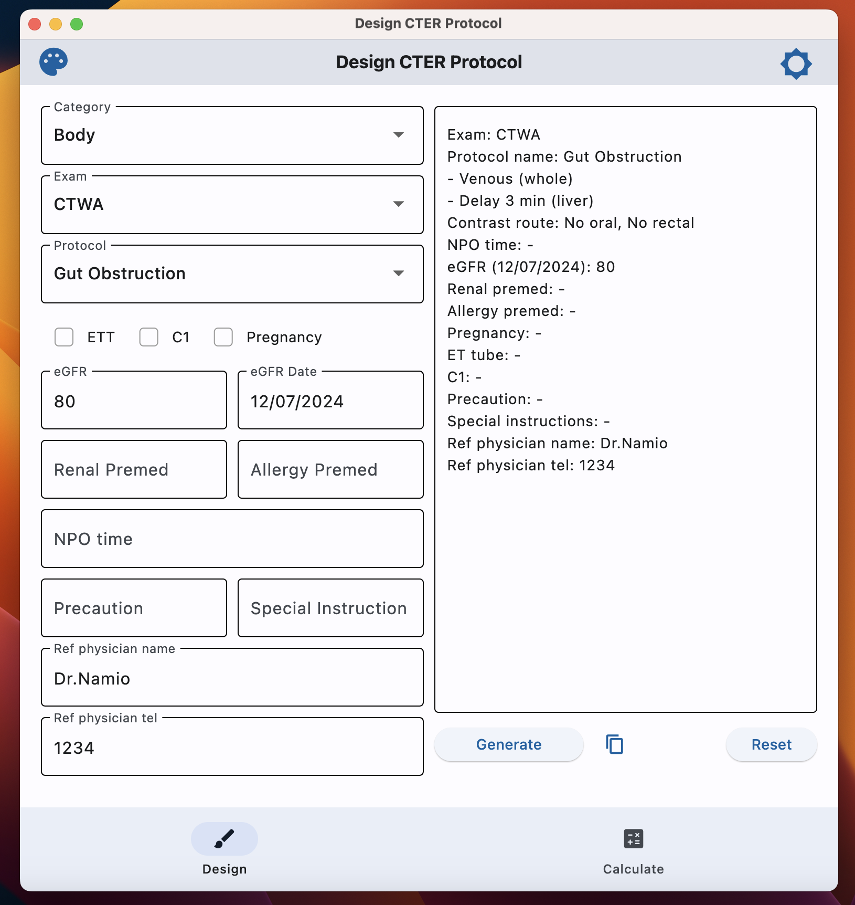
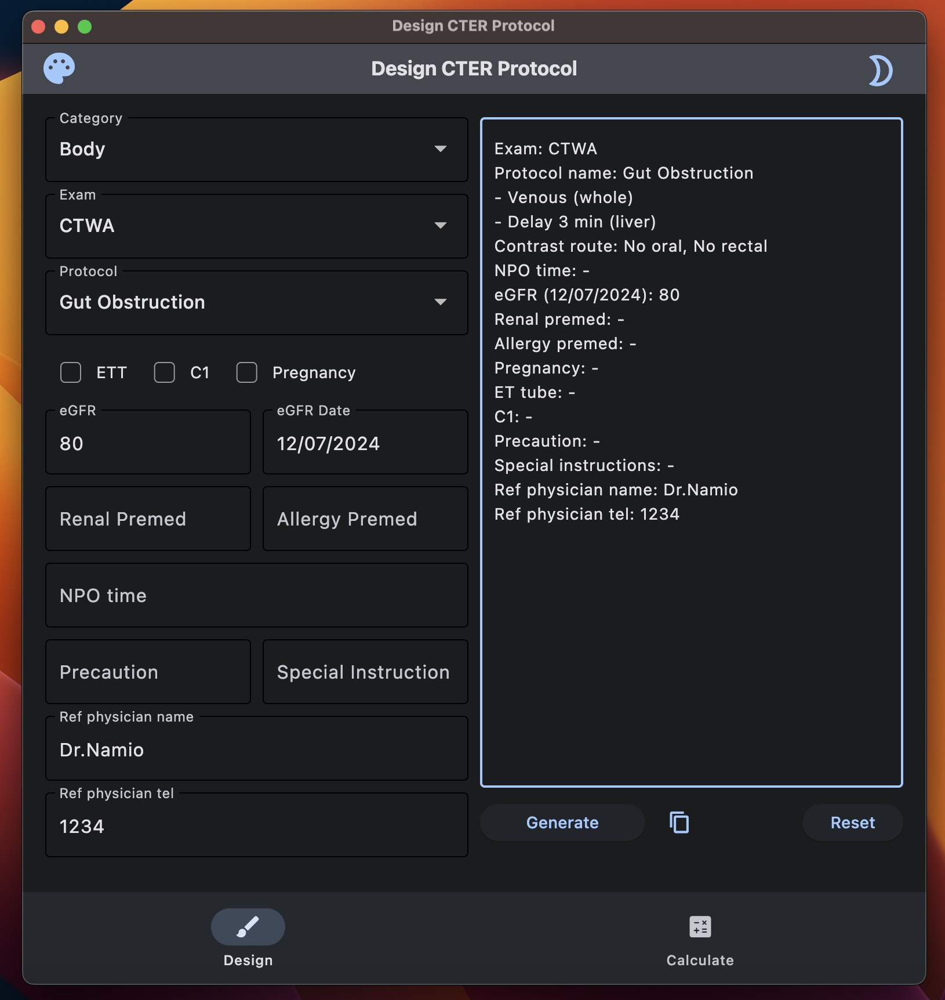
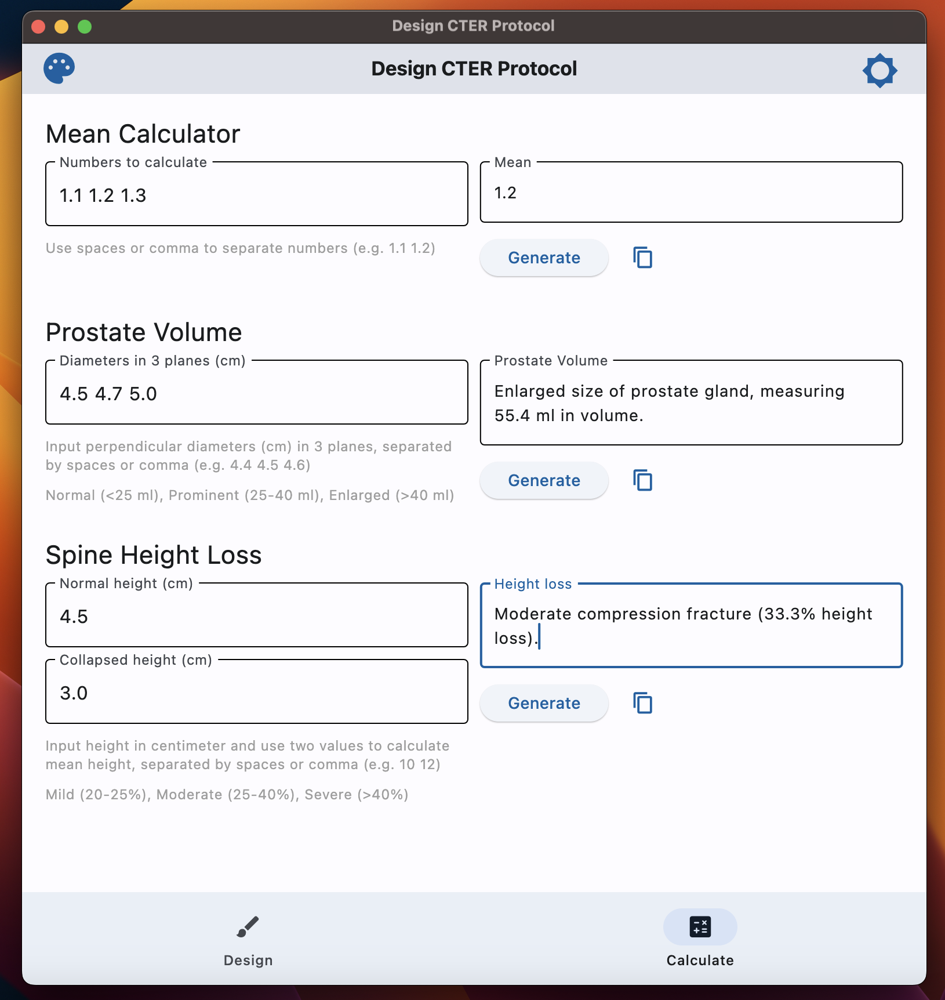
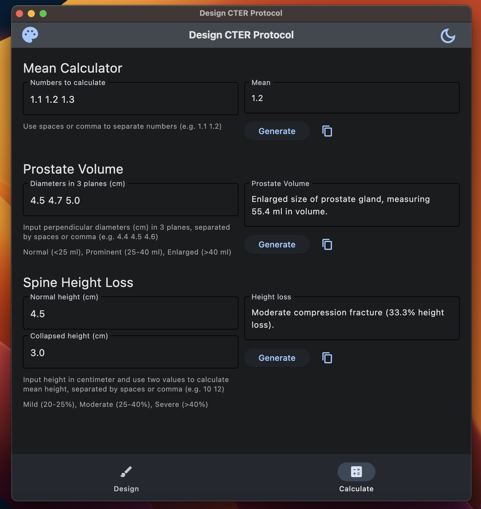
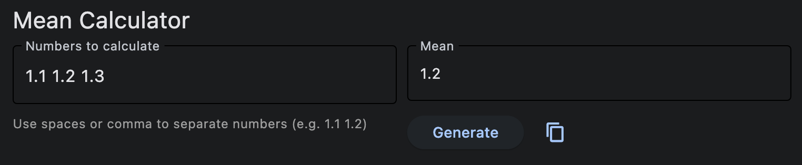
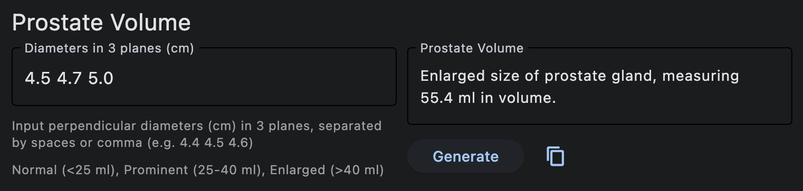
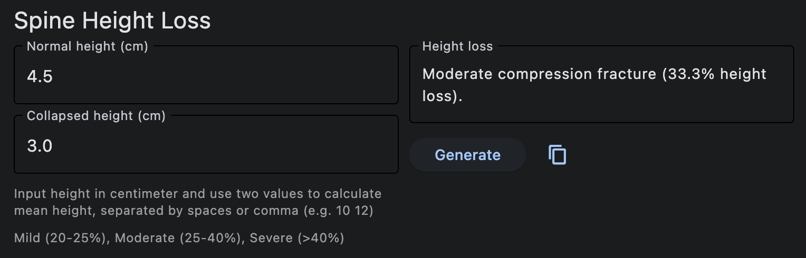

# Design CTER App <a href="https://github.com/Lightbridge-KS/designCTER"></a>


> **Cross-platform application for design CT protocol in emergency department for my institution.**


---

**Build using [Flet](https://flet.dev/)**, a cross-platform UI framework in Python.

[](https://ci.appveyor.com/project/Lightbridge-KS/designcter) [](https://app.netlify.com/sites/design-cter/deploys)

- **Web app:** <https://design-cter.netlify.app>

- **Desktop app:** see [release](https://github.com/Lightbridge-KS/designCTER/releases)

---

## Mode

### Tab 1: Design CT Protocol

Light            |  Dark
:-------------------------:|:-------------------------:
  |   

This mode will generate CT protocols available from 3 levels dropdown: "category", "exam", and "protocol". Other information can be filled in the input text field. Once finished, user can press **Generate**, then the protocol will render accordingly in the output text field. 


### Tab 2: Calculator

Light            |  Dark
:-------------------------:|:-------------------------:
  |   

This helper mode can be use as a calculator for writing radiology report which includes  build-in calculator for common task, such as mean calculator (for calculate dose), prostate volume, and spine height loss.

**Mean calculator:** 



- Calculate mean value from input numbers (separated by blank space or comma)

**Prostate volume:** 



- **Input:** Perpendicular diameter (cm) of prostate in 3 planes
- **Output:** A report for prostate volume with severity (normal, prominent, or enlarged size), using ellipsoid formula.

**Spine Height Loss:**



- **Input:** Normal and collapsed height of spine. If there is no normal reference of the spine (e.g. severe collapse), the height of the two adjacent vertebrae can be used by input two numbers in the "Collapsed height (cm)" textbox (separated by blank space or comma).
- **Output:** A report for percentage of vertebral compression fracture with grading (mild, moderate, severe) using [Genant's classification](https://radiopaedia.org/articles/44227). 


## Build from Source

### Installation

1. Install [flet](https://flet.dev/docs/guides/python/getting-started) and [pyperclip](https://pypi.org/project/pyperclip/) with:

```shell
pip install -r requirements.txt
```

2. [Install Flutter](https://docs.flutter.dev/get-started/install)


### Build app

```shell
cd to/directory/root
# Build
flet build <target_platform>
```

`<target_platform>` could be one of the following: `apk`, `aab`, `ipa`, `web`, `macos`, `windows`, `linux`.
