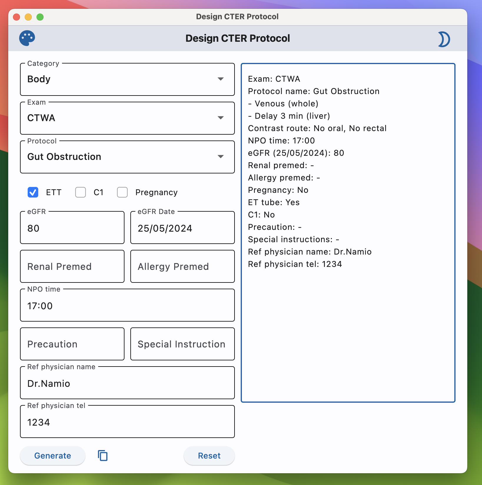
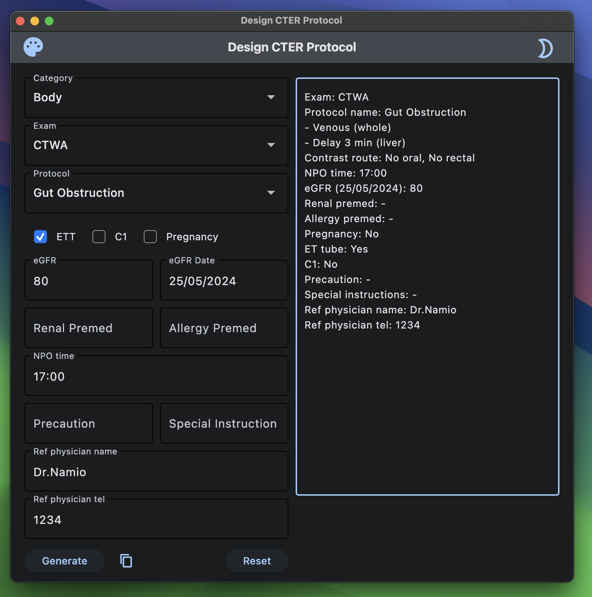

# Design CTER App <a href="https://github.com/Lightbridge-KS/designCTER"></a>


> **Cross-platform application for design CT protocol in emergency department for my institution.**

Light            |  Dark
:-------------------------:|:-------------------------:
  |   

---

**Build using [Flet](https://flet.dev/)**, a cross-platform UI framework in Python.

[](https://ci.appveyor.com/project/Lightbridge-KS/designcter) [](https://app.netlify.com/sites/design-cter/deploys)

- **Web app:** <https://design-cter.netlify.app>

- **Desktop app:** see [release](https://github.com/Lightbridge-KS/designCTER/releases)

---

## Build from Source

### Installation

1. Install [flet](https://flet.dev/docs/guides/python/getting-started) and [pyperclip](https://pypi.org/project/pyperclip/) with:

```shell
pip install -r requirements.txt
```

2. [Install Flutter](https://docs.flutter.dev/get-started/install)


### Build app

```shell
cd to/directory/root
# Build
flet build <target_platform>
```

`<target_platform>` could be one of the following: `apk`, `aab`, `ipa`, `web`, `macos`, `windows`, `linux`.
