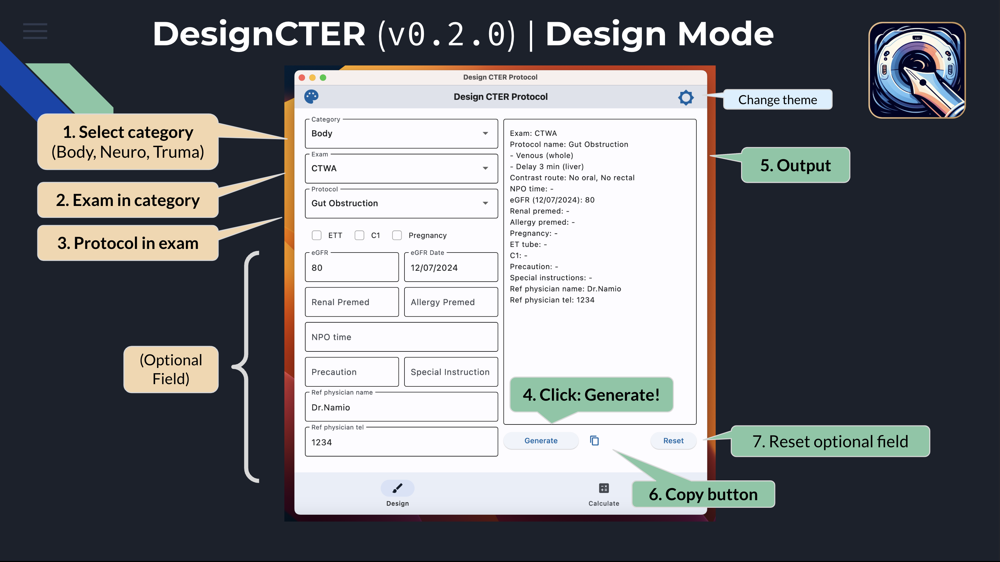

# Introduction {#sec-introduction}

::: {.callout-note appearance="default"}
## About
Welcome 👋, this is a user guide for [**DesignCTER**](https://design-cter.netlify.app), a cross-platform application for design CT protocols in emergency department.
:::

---

**Web App:** <https://design-cter.netlify.app> 

**Desktop App:** please see [release in GitHub](https://github.com/Lightbridge-KS/designCTER/releases)

**Code:** [GitHub](https://github.com/Lightbridge-KS/designCTER)

---

## Overview 

This app consist of two modes in the bottom tab:

1. **Design:** Design CT Protocol (@fig-design-mode)

   -   Principle for design a CT protocol see @sec-protocols-basic.
   -   Details for each protocols see @sec-protocols-docs.

2. **Calculate:** Calculators for commonly used formula in radiology (@fig-cal-mode)

## Design Mode

{#fig-design-mode width=70% fig-align="center"}

1. This mode will generate CT protocols available from 3 levels dropdown: "category", "exam", and "protocol". 
2. Other information can be filled in the input text field or checkboxes. 
3. Once finished, user can press **Generate**, then the protocol will render accordingly in the output text field. 

{width=100% fig-align="center"}

## Calculator Mode

{#fig-cal-mode width=70% fig-align="center"}

This helper mode can be use as a calculator for writing radiology report which includes  build-in calculator for common task, such as mean calculator (for calculate dose), prostate volume, and spine height loss.

### Mean calculator

- To calculate mean value from any input numbers (separated by blank space or comma)

- **Usage example:** type `1.1` `1.2` `1.3` then press "Enter" or click "Generate", the app will calculate mean values, which is `1.2`.

### Prostate volume

- **Input:** Perpendicular diameter (cm) of prostate in 3 planes (separated by blank space or comma).
- **Output:** A report for prostate volume, using ellipsoid formula.

- **Usage example:** If diameter(s) of a prostate were 4.5, 4.7, and 5.0 cm in 3 planes:
  1. Type `4.5` `4.7` `5.0` in the textbox
  2. Press "Enter" or click "Generate"
  3. The app will calculate prostate volume and interpretation in the output dialog,  which can be copied to report.

Interpretation of prostate volume was based on the following criterion:

- **Normal** (< 25 ml)
- **Prominent** (25-40 ml)
- **Enlarged** (> 40 ml)

::: {.callout-note appearance="default" collapse="true"}
#### Ellipsoid volume formula

$$
\frac{4}{3} \pi \times r_1 \times r_2 \times r_3 
$$ {#eq-ellipsoid-vol-full}

Where $r_1$, $r_2$, $r_3$ are radius along 3 perpendicular axis, or

$$
\frac{1}{6} \pi \times D_1 \times D_2 \times D_3 \approx 0.5 \times D_1 \times D_2 \times D_3
$$ {#eq-ellipsoid-vol-appr}

Where $D_1$, $D_2$, $D_3$ are diameter along 3 perpendicular axis.

:::

### Spine Height Loss

- **Input:** Normal and collapsed height of spine. If there is no normal reference of the spine (e.g. severe collapse), the height of the two adjacent vertebrae can be used by input two numbers in the "Collapsed height (cm)" textbox (separated by blank space or comma).
- **Output:** A report for percentage of vertebral compression fracture with grading (mild, moderate, severe) using [Genant's classification](https://radiopaedia.org/articles/44227). 

**Usage example:** If Normal height = 4.5 cm, Collapsed height = 3.0 cm

  1. Type `4.5` in "Normal height" and `3.0` in "Collapsed height" textbox
  2. Press "Enter" or click "Generate"
  3. Percentage of height loss and severity will be calculated, in this case:

$$
\text{Height loss} = (4.5 - 3.0) \times 100 / 4.5 = 33.3\%
$$

Which is moderate height loss according to [Genant's classification](https://radiopaedia.org/articles/44227).

::: {.callout-note appearance="default" collapse="true"}
#### Genant's classification

- Grade 0: Normal
- Grade 1: Mild loss of height (20-25%)
- Grade 2: Moderate loss of height (25-40%)
- Grade 3: Severe loss of height (> 40%)

:::